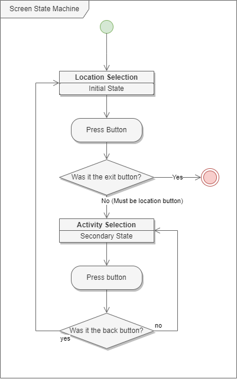
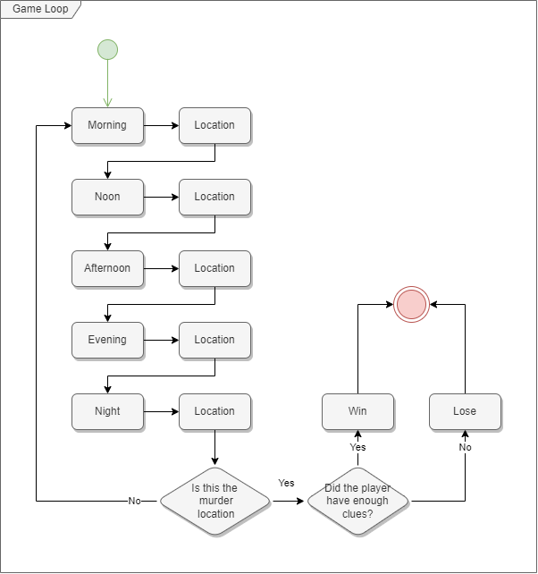

# COMP3016 CW1 - Before Midnight

## Version Information
- Visual Studio version: 2022 17.4.2
- Operating system version: Windows 10 Pro 22H2

## How does it play
Before Midnight is a game where the player is trapped in a time loop, cursed to repeat each day. In the players dream, they get told that someone is going to die, and unless the chain is broken, they will be stuck in the loop forever.

So, the player's goal is to prevent the murder from happening at the night of the day. If they get enough clues, they can. Otherwise they might get murdered too.

Each playthrough of the game is different, generating different murder scenarios and clue locations each time. For good replayability.

## UML diagrams
This UML diagram shows the screen states the player will go through to.

This shows the gameplay loop

## Exception handling
The game regularly uses exception handling to ensure the game doesn't crash, or have any memory leaks. There are also constant debugging messages for everything the player can do to help test. The game in theory will never crash, it will only report an error in the debug console.

## Youtube Video
https://youtu.be/02UfoaAL-qQ

## GitHub Link
https://github.com/BenB-R/COMP3016-CW1
